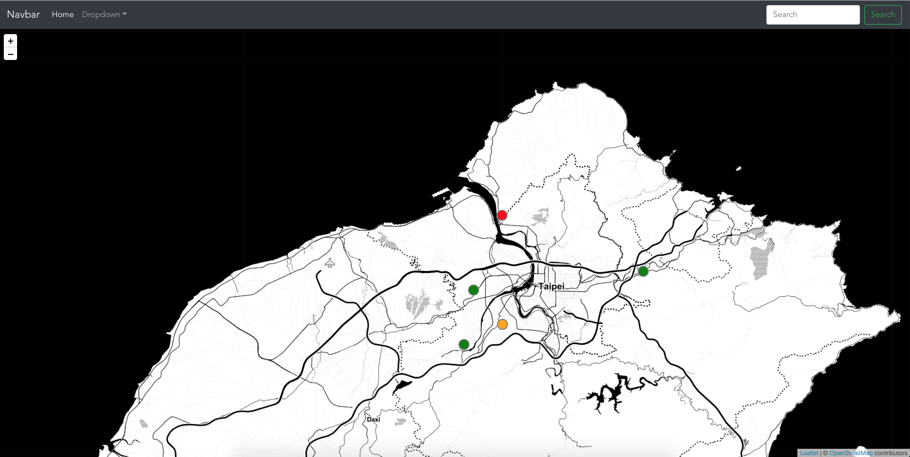

# 路燈即時監控

## 畫面

## 簡介
#### 此專案設定為物聯網（IoT）路燈監控系統，使用者可以透過網頁：
1. 檢視路燈的即時狀態、詳細資料
    - 路燈狀態：
        - Normal （以綠色顯示）
        - Warning （以黃色顯示）
        - Error （以紅色顯示）
2. 控制路燈亮度、開關、排程
#### 滑鼠 hover 在座標上，可顯示路燈簡易資料
- 

#### 補充
- 個人測試，可接受數十萬筆資料（視每一筆詳細資料大小浮動）
    - 附上完整專案截圖
    
    

## 核心技術
#### Leaflet.js
- 開源地圖繪製工具
#### RabbitMQ
- 使用 `Docker` 架設，作為 `MQTT` 的 `Broker`
- 如何架設可參考個人另一篇[文章](https://hackmd.io/@class90431/RabbitMQWithDocker)
#### MQTT over WebSockets
- 藉由 `MQTT` 特性（小型傳輸、開銷很小）非常適合應用在 `IoT`，並結合網頁接收即時訊息（`WebSockets`）
#### TypeScript
- 此 Demo 用 TypeScript 撰寫