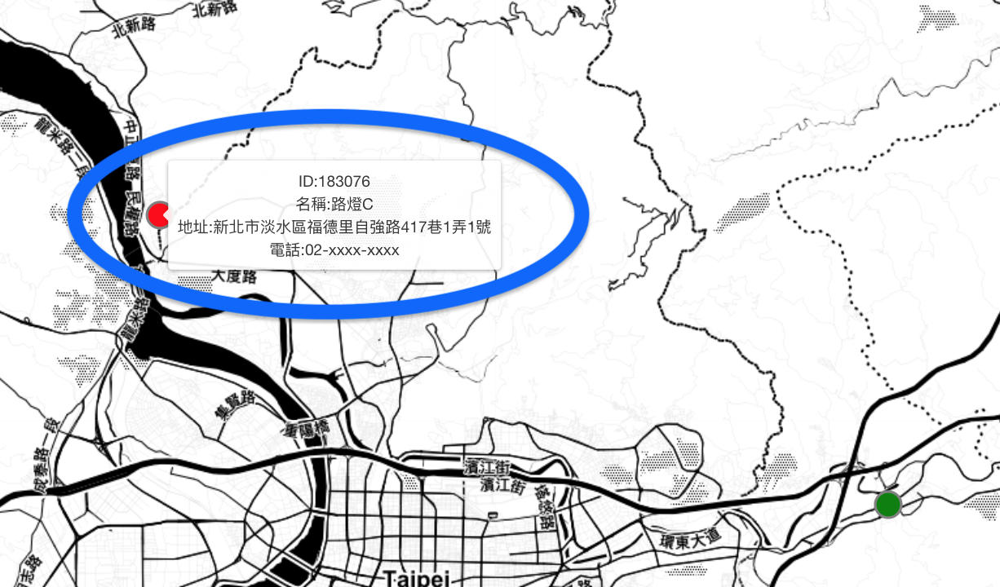

# 路燈即時監控

## 畫面

## 簡介

#### 使用者可用網頁監控路燈的即時狀態、詳細資料
- 路燈狀態：
    - Normal （以綠色顯示）
    - Warning （以黃色顯示）
    - Error （以紅色顯示）

## 操作
#### 滑鼠 hover 在座標上，可顯示路燈詳細資料：
- 路燈 ID
- 名稱
- 地址
- ...

#### 滑鼠滾輪可 zoom in / out 地圖

## 核心技術
#### Leaflet.js
- 開源地圖繪製工具
#### RabbitMQ
- 使用 `Docker` 架設，作為 `MQTT` 的 `Broker`
- 如何架設可參考個人另一篇[文章](https://hackmd.io/@class90431/RabbitMQWithDocker)
#### WebSocket
- 藉由 `WebSocket` 協定，讓網頁能即時更新路燈最新資料
#### mqtt.js
- `JavaScript` 套件，用於訂閱（Subscribe）`MQTT` 的 `Topic`
#### TypeScript
- 此 Demo 用 TypeScript 撰寫